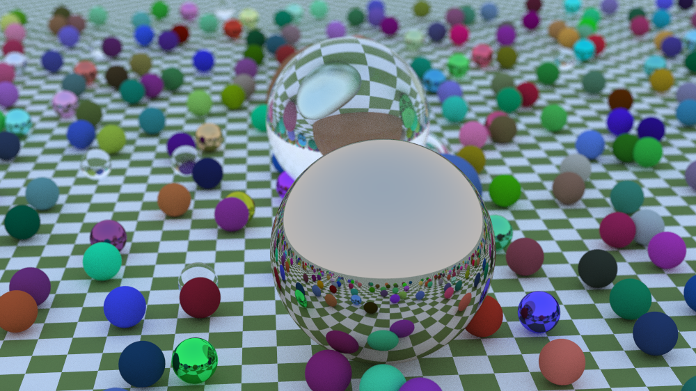
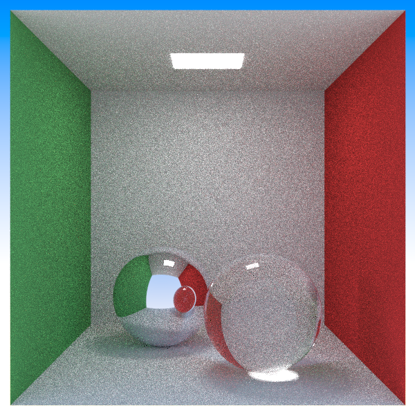

# Monte Carlo Ray Tracer

A modern physically-based Monte Carlo ray tracer written in C++.


*Sample scene showcasing spheres with dielectric, specular, and diffuse materials*

## Features

### Core Rendering
- **Monte Carlo Path Tracing**: Physically-based light transport simulation
- **Wavefront Rendering**: Efficient batch-based traversal; future GPU support
- **BVH Acceleration**: SAH-binned BVH for fast intersection testing
- **Multi-threaded CPU Renderer**: OpenMP-based parallel ray evaluation

### Geometry Support
- **Primitive Intersections**: Optimized sphere, quad, and triangle routines
- **Mesh Loading**: OBJ mesh support through TinyObjLoader
- **Instancing**: Scale, rotate (Y-axis), and translate mesh instances

### Material System
- **Lambertian Diffuse** with cosine-weighted sampling
- **Metallic BRDF** with roughness
- **Dielectric Refraction** with Fresnel equations
- **Texture Mapping** from image files
- **Checker and procedural textures**

### In Progress
- **Hybrid GPU Rendering**: GPU BVH traversal and path integration

## Dependencies

- **STB Libraries**: `stb_image.h`, `stb_image_write.h`
- **JSON Library**: [nlohmann/json](https://github.com/nlohmann/json)
- **tinyobjloader**: OBJ geometry import
- **OpenMP**: CPU multi-threading
- **C++17 or later** compiler

## Building

```bash
# Clone the repository
git clone https://github.com/Luke-TS/LTS-PathTracer.git
cd LTS-PathTracer 

# Create build directory
mkdir build && cd build

# Configure and build
cmake ..
cmake --build .


```

## Usage

Scenes are described entirely through JSON. View examples in /scenes or use template below:

```json
{
  "camera": {
    "aspectRatio": 1.777,
    "imageWidth": 600,
    "samplesPerPixel": 100,
    "maxDepth": 25,

    "vfov": 40,

    "lookfrom": [-4,2,8],
    "lookat":   [0,0,0],
    "vup":      [0,1,0]
  },

  "textures": {
    "earth_map": {
      "type": "image",
      "path": "earthmap.jpg"
    },
    "checker": {
      "type": "checker",
      "scale": 0.32,
      "color1": [0.2, 0.3, 0.1],
      "color2": [0.9, 0.9, 0.9]
    }
  },

  "materials": {
    "earth": { "type": "lambertian", "texture": "earth_map" },

    "left": { "type": "lambertian", "albedo": [0.1, 0.2, 0.5] },
    "center":   { "type": "dielectric", "ior": 1.5 },
    "bubble": { "type": "dielectric", "ior": 0.666 },

    "right":  { "type": "metal", "albedo": [0.8, 0.6, 0.2], "fuzz": 1.0 },

    "checker_mat": { "type": "lambertian", "texture": "checker" }
  },

  "objects": [
    { "type": "sphere", "center":[0.0,-1000.0,0.0], "radius":1000.0, "material":"checker_mat" },

    { "type": "sphere", "center":[0,1,0], "radius":1.0, "material":"left" },

    { "type": "sphere", "center":[-3,1,0], "radius":1.0, "material":"center" },
    { "type": "sphere", "center":[-3,1,0], "radius":0.8, "material":"center" },

    { "type": "sphere", "center":[3,1,0], "radius":1.0, "material":"right" }
  ]
}

```

## Rendering

```bash
./raytracer <scene.json> [output.ext]
```

Support outputs: png, ppm

## Example Renders

> **Note:** Working to implement Next-Event Estimation to reduce noise in Cornell Box render.

| Cornell Box | Textured Mesh |
|-------------|---------------|
|  |  |


## References

- *Ray Tracing in One Weekend* series by Peter Shirley
- *Physically Based Rendering: From Theory to Implementation* by Pharr, Jakob, and Humphreys
